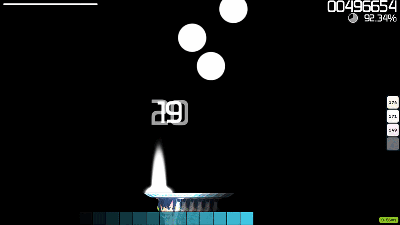
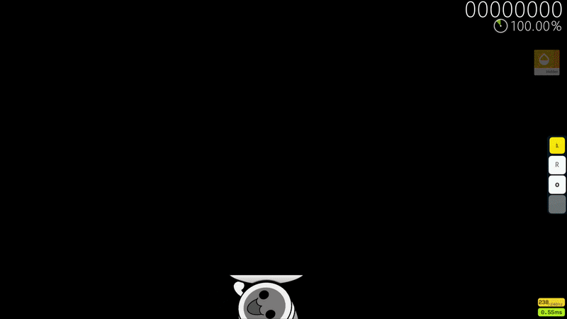

<p align="center">
  <picture>
    <source media="(prefers-color-scheme: dark)"  srcset="docs/logo-dark.png">
    <source media="(prefers-color-scheme: light)" srcset="docs/logo-light.png">
    
  </picture>
</p>

# VAM:SF - Variable AR Modification: Storybrew Framework (osu!catch)

**Variable AR Modification - a storyboard framework for osu!catch.**

VAM renders a pixel-accurate storyboard copy of an osu!catch map with a fake dynamic Approach Rate, fake Hidden, mania-style Scroll Velocity, and more!


[](https://steelplank.github.io/VAM-SF/)

### Full documentation: **[steelplank.github.io/VAM-SF](https://steelplank.github.io/VAM-SF/)**

Install steps, the profile syntax, copy-paste examples, and the FAQ all live on the docs site - much easier to read than the raw files here.

| Dynamic AR | Scroll Velocity |
|:---:|:---:|
|  |  |

| Fake Hidden | Skin Support |
|:---:|:---:|
|  |  |

## Showcase

<p align="center">
  <a href="https://youtu.be/LUY3zBq9lSM">
    
  </a>
  <br>
  <i>Click to watch the showcase on YouTube.</i>
</p>

---

## What it does

VAM is the ultimate answer for mappers and players that want to have more control over a map. osu!catch is rather limited compared to other modes so I've decided to fix it. Originally made for a gimmick tournament (PWD) - turned into a fully-fledged project with a way wider scope.

## How it works

Using storyboard and overlay layer, we can generate gameplay objects identical to osu!catch. By covering majority of the screen, we can hide almost all game elements and replace their function with storyboard elements. Since beatmap is deterministic and player inputs don't affect how fruits are being generated, we can create a pretty convincing illusion for any kind of map.

## Features

- **Installator and helper** - easy install script including modifying the .osu file to make your life easier!
- **Recreation of osu! RNG model** - full recreation of osu!catch droplets and banana randomization!
- **Dynamic AR** - control and change AR during gameplay using keyframes with easing! Exceed normal osu! AR values and torment people with maps on AR 12!
- **Scroll Velocity** - mania-style SV: rush, slow, or freeze the whole field!
- **Fake Hidden** - add hidden to the mix with adjustable HD strength!
- **Fade-In** - why bother with lane cover when you can have fade-in! You can mix FI and HD together!
- **Player Skin Support** - with this enabled, skin elements are dynamically used! Rotation for square skins is fully supported!
- **Miss Simulator** - <del>fake "osu-like" simulation of a miss where the object will fall below the platter. (fruits-only feature)</del> - **WARNING:** Due to osu! storyboard triggers bug, this feature will tank your ms over time! **NOT** recommended to use on longer maps or maps going for tournaments!
- **Countdown** - overlay can and will cover osu! built-in countdown so we have our own implementation!
- **Cover with background support** - you should always use cover together with the generator but nobody said it has to be pure black.
- **Map Combo Colors** - an option to use map combo colors. (experimental)
- **Publish-ready script** - included some quality-of-life scripts that will make mass-edits easy and quick.
- **Custom interpreter** - program keyframes and all efects in one file thanks to a robust interpreter. Now including loop statements!
- **Mod support** - make own mods for the engine and share them with others! Basic template and example mod included, seamless integration with profile file.

## Requirements

- latest osu! stable build
- [storybrew](https://github.com/Damnae/storybrew)

## Install

1. Download the latest **[release](../../releases/latest)** (the `.zip`).
2. Extract the `VAM-SF` folder into your storybrew project root folder.
3. Run **`Install.bat`** and choose **Install**.
4. In storybrew, add the effects and set the cover's OSB layers.

See the full guide: **[Install guide](https://steelplank.github.io/VAM-SF/INSTALL/)** - scripted and manual install, storybrew setup, managing an install, and publishing.

EXTRA: see the full guide for non-technical audience (thanks trig0n for extra work): **[Easy install guide](https://steelplank.github.io/VAM-SF/EZ_INSTALL/)**

## Configuring

Program AR, Hidden, and Scroll Velocity over time in **`VAM-profile.txt`** - the file documents its own syntax.

For more detailed overview of all features, including creating your own mods, see the **[full guide](https://steelplank.github.io/VAM-SF/GUIDE/)**. Ready-to-paste profile snippets are on the **[examples page](https://steelplank.github.io/VAM-SF/EXAMPLES/)**.

## Example maps

Five maps built with VAM:SF, showing off dynamic AR, Scroll Velocity, hold-then-snap, and Hidden. Grab them individually on osu! (links below), or **[download the whole pack](https://malai.s-ul.eu/xODOVDan)**.

- [**DM Ashura - deltaMAX**](https://osu.ppy.sh/beatmapsets/2616404#fruits/5867596)
- [**PSYQUI - Hysteric Night Girl feat. Such (android52 Edit)**](https://osu.ppy.sh/beatmapsets/2616400#fruits/5867592)
- [**Rabpit - Dream**](https://osu.ppy.sh/beatmapsets/2616398#fruits/5867590)
- [**Risshuu feat. Choko - Take**](https://osu.ppy.sh/beatmapsets/2616402#fruits/5867594)
- [**Unknown Artist - Yatsume Ana**](https://osu.ppy.sh/beatmapsets/2616403#fruits/5867595)

## FAQ

The most common questions are below. There's a fuller, searchable version on the **[docs FAQ page](https://steelplank.github.io/VAM-SF/FAQ/)**.

<details>
<summary><b>The objects are invisible in storybrew!</b></summary>

That's expected when **`UseSkinSprites`** is on - osu!'s skin sprites don't render inside storybrew. Edit effects in storybrew with `UseSkinSprites` set to off, then flip it back on when you're exporting the final version of the storyboard.

</details>

<details>
<summary><b>The objects drift out of line with gameplay / fruits fall past the platter on my monitor.</b></summary>

Check your resolution's aspect ratio. VAM lines up on **16:9** and **4:3**, but **not on 5:4** (e.g. 1280×1024) or anything narrower than 4:3.

If you *only* ever play or record on 5:4, you can compensate by hand: set **VAM_Generator**'s **`CenterX`** from `320` to `300` and rebuild. That realigns 5:4 but it then breaks 16:9 and 4:3.

</details>

<details>
<summary><b>My fruits look wobbly as they fall</b></summary>

Your skin fruit elements might not be perfectly centered. Each fruit gets a fixed tilt at spawn and never actually spins during the fall, so it's an optical illusion, not motion (osu! stable does the exact same thing). If it bothers you, turn off "Rotate Objects" in basic settings inside of the VAM_Generator effect.

</details>

<details>
<summary><b>My storyboard isn't working in-game / the objects don't appear.</b></summary>

Run the installer's **Diagnose setup (doctor)** option (`install.ps1` → Tools → Diagnose, or `-Action doctor`). It checks for the most common issues and prints the fix. The usual culprits are:

- The `.osu` flags **`WidescreenStoryboard: 1`** and **`UseSkinSprites: 1`** aren't set (re-run Install / Upgrade).
- **VAM_Generator** isn't at the **very bottom** of the effect list, so the objects draw on top of the cover.
- The cover's OSB layers are wrong - the top region must be **Overlay**, the bottom region **Background**.

</details>

<details>
<summary><b>I added HD / FI / SV keyframes but nothing changes.</b></summary>

Each feature needs its master toggle on in **VAM_Generator**: **`EnableHidden`** for `hd`, **`EnableFadeIn`** for `fi`, **`EnableScrollVelocity`** for the `[sv]` section.

</details>

<details>
<summary><b>Storyboard not working for multiple difficulties</b></summary>

Storybrew exports to .osb either for the entire set or per each difficulty in the set. If you want only one difficulty to have the storyboard, you should use the `Quick Publish` option in the installer script to comine .osb with .osu file of the selected difficulty.

Highly recommend working on one difficulty, exporting .osb for the entire set, then combining that with .osu before moving on to the next difficulty. But maybe you can have a more efficient workflow.

</details>

<details>
<summary><b>The installer errors with "System.Drawing isn't available", or can't find my project.</b></summary>

Run it with **Windows PowerShell** - `System.Drawing` isn't in other shells. And keep the whole **`VAM-SF`** folder **inside your storybrew project** (the folder with the `.sbrew` file), or pass `-ProjectPath "<project folder>"`.

</details>

## Support & feedback

Found a bug or have a feature idea? Open a **[GitHub issue](../../issues)** - that's the place for anything actionable, and it's how VAM:SF gets better.

For "how do I..." questions, ping me as **@Malai** on Discord (I'm around the catch mapping servers) rather than the tracker - issues are for bugs and requests, and the **[easy guide](https://steelplank.github.io/VAM-SF/EZ_INSTALL/)** and **[full guide](https://steelplank.github.io/VAM-SF/GUIDE/)** already answer most of the common ones.

## Credits

- Phob - provided almost entire beatmap converter <3
- PWD staff including poolers, mappers, and map testers - for being my beta testers, reporting issues, and suggesting changes

## License

VAM:SF is released under the **[GNU General Public License v3.0](LICENSE)**.

```
VAM:SF - Variable AR Modification: Storybrew Framework
Copyright (C) 2026 Malai

This program is free software: you can redistribute it and/or modify
it under the terms of the GNU General Public License as published by
the Free Software Foundation, either version 3 of the License, or
(at your option) any later version.

This program is distributed in the hope that it will be useful,
but WITHOUT ANY WARRANTY; without even the implied warranty of
MERCHANTABILITY or FITNESS FOR A PARTICULAR PURPOSE.  See the
GNU General Public License for more details.
```

The bundled beatmap converter and the recreated osu! default sprites remain the property of their respective authors.
