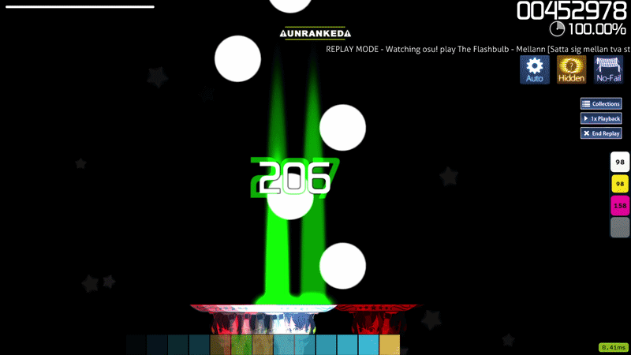
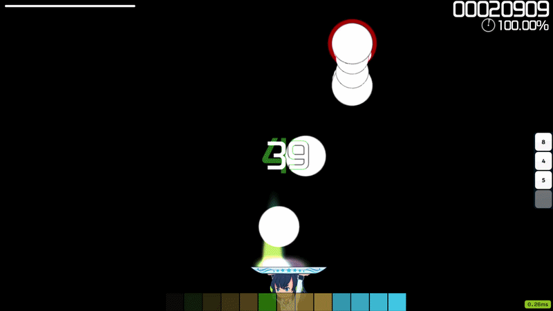

# VAM:SF - Variable AR Modification: Storybrew Framework (osu!catch)

**Variable AR Modification - a storyboard framework for osu!catch.**

VAM renders a pixel-accurate storyboard copy of an osu!catch map with a fake dynamic Approach Rate, fake Hidden, mania-style Scroll Velocity, and more!

---

## What it does

VAM is the ultimate answer for mappers and players that want to have more control over a map. osu!catch is rather limited compared to other modes so I've decided to fix it. Originally made for a gimmick tournament (PWD) - turned into a fully-fledged project with a way wider scope.

## How it works

Using storyboard and overlay layer, we can generate gameplay objects identical to osu!catch. By covering majority of the screen, we can hide almost all game elements and replace their function with storyboard elements. Since beatmap is deterministic and player inputs don't affect how fruits are being generated, we can create a pretty convincing illusion for any kind of map.

## Features

- **Dynamic AR** - control and change AR during gameplay using keyframes with easing!
- **Fake Hidden** - add hidden to the mix with adjustable HD strength!
- **Scroll Velocity** - mania-style SV: rush, slow, or freeze the whole field!
- **Countdown** - overlay can and will cover osu! built-in countdown so we have our own implementation! (work in progress)
- **Flashlight** - fake flashlight that follows the objects, not the catcher! (work in progress)

## Showcase

<!-- A couple of short clips side by side. Put the gifs in docs/ and swap the paths. -->
| Dynamic AR | Scroll Velocity |
|:---:|:---:|
|  |  |

## Requirements

- latest osu! stable build
- [storybrew](https://github.com/Damnae/storybrew)

## Install

1. Download the latest **[release](../../releases/latest)** (the `.zip`).
2. Extract the `VAM-SF` folder into your storybrew project root folder.
3. Run **`Install.bat`** and choose **Install**.
4. In storybrew, add the effects and set the cover's OSB layers.

Full setup &amp; troubleshooting

[Soon]

## Configuring

Program AR, Hidden, and Scroll Velocity over time in **`VAM-profile.txt`** - the file documents its own syntax.

## Status

Early alpha (**v0.21**) with not much testing besides my own machines. Flashlight and countdown are still being worked on.

## Credits

- Phob - done almost entire beatmap converter <3

## License

Soon
